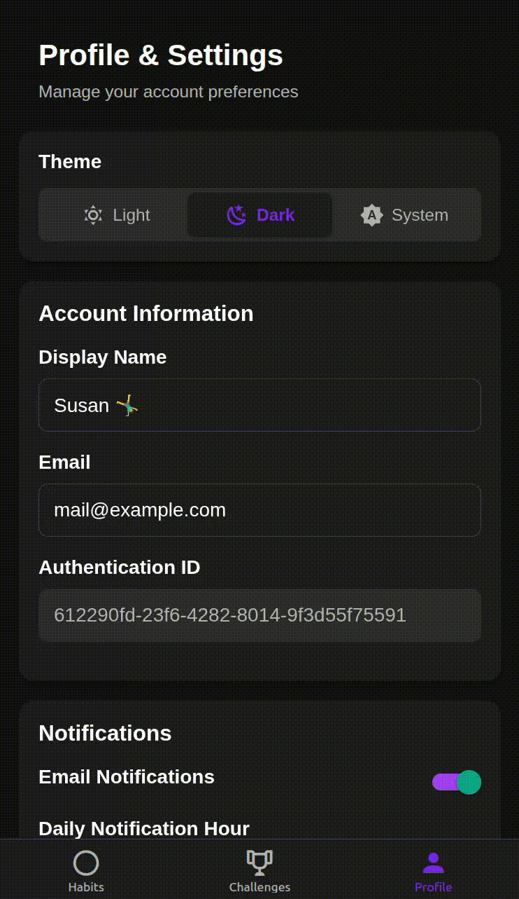
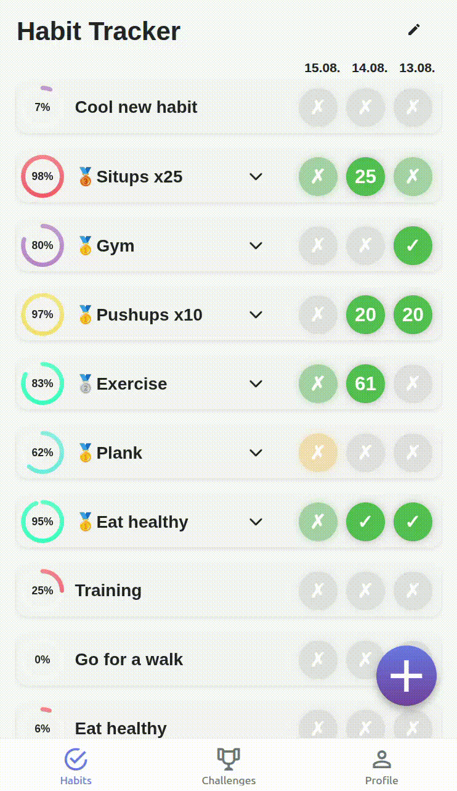

<div align="center">
  
</div>

<div align="center">

# HabitSync

</div>

<p align="center">
    <a href="https://github.com/jofoerster/habitsync/actions/workflows/release.yml">
        
    </a>
    <a href="https://ghcr.io/jofoerster/habitsync">
       
    </a>
    <a href="https://github.com/jofoerster/habitsync/releases/latest">
        
    </a>
</p>

<div align="center">
  A powerful, self-hostable habit tracking platform with social features.

Transform your daily routines into lasting habits while connecting with friends through shared challenges and progress
tracking.

**Try the Demo: [https://demo.habitsync.de](https://demo.habitsync.de)**

</div>

---

<div align="center">
  
  
  
</div>
<div align="center">
  
  
  
</div>

---

## ✨ Key Features

### 🚀 **Simple & Intuitive**

- **Clean, user-friendly interface** designed like a "normal" habit tracker for daily use and quick habit logging
- **Progressive Web App (PWA)** install directly from your browser
- **📱 Mobile App (Android, see [Downloads](#download-mobile-app))**

### 🎯 **Extensive Goal Configuration**

- **Flexible habit tracking** with customizable goals and frequencies
- **Variety of habit types**: daily, weekly, monthly, or custom intervals
- **Negative habits** to track and reduce unwanted behaviors
- **Weekday selection** choose specific days for habit tracking

### 👥 **Social & Sharing Features**

- **Shared habits** to track progress with friends and family
- **Monthly challenges** with community voting and leaderboards
- **Achievement system** with medals for top performers
- **Progress comparison** to stay motivated together

### 🔐 **Flexible Authentication, build for sharing**

- **SSO OIDC integration** via public clients (PKCE flow)
- **Multi-issuer support** (combine personal sso server with public provider for external users)
- **Optional user approval** require approval for new users (per issuer)

### 🔔 **Flexible Notification System**

- **Apprise integration** - send notifications anywhere (Discord, Email, Signal, Home Assistant, and 80+ services)
- **Custom notification schedules** configure days and times for reminders
- **Smart triggers** with customizable conditions:
    - ✅ **Scheduled reminders** if you haven't logged your habit
    - 📈 **Threshold alerts** when you fall below a certain percentage
    - 🏆 **Overtake notifications** when friends surpass your progress

### 🌓 **Modern Experience**

- **Dark/Light mode** support for comfortable viewing
- **Responsive design** that works on all devices
- **Easy Docker deployment** for quick setup
- **API-first architecture** swagger docs available, ready for external integrations (see [API](#api-documentation))

### 📥 **Import**
- **Import your data** from Loop Habit Tracker

## Download mobile App

[](https://github.com/jofoerster/habitsync/releases/latest)

I recommend using [Obtainium](https://github.com/ImranR98/Obtainium) to keep the app updated.
Please be aware that the mobile app is in development and needs to be kept up to date with the server version.

## Integrate with Home Assistant

Use the REST API to integrate HabitSync with Home Assistant. See the detailed instructions in
[README-Home-Assistant.md](README-Home-Assistant.md).

## Deployment

### Docker (Quickstart for testing)

Start locally using Docker with the following command:

```
docker run \
  -p 6842:6842 \
  -e BASE_URL=http://localhost:6842 \
  -e 'APP_SECURITY_BASIC-AUTH-USERS_test=$2y$10$EyuJ.fL/PzCTMMKTONEquuFLxAR8SAzl9iXF2v.qDZYCh5K2m78fS' \
  ghcr.io/jofoerster/habitsync:latest
```

When started, login under `http://localhost:6842` with username `test` and
password `PASSWORD`.

### Docker Compose (Recommended for production use)

```
services:
  web:
    image: ghcr.io/jofoerster/habitsync:latest
    environment:
      - BASE_URL=https://your-domain.com/
      # Choose one or more of the following authentication methods:
      # OIDC Issuers (tested with Authelia, Google), use public client settings (PKCE flow), 
      # set BASE_URL/auth-callback as redirect, for mobile: habitsync:///auth-callback
      # more than one issuer can be configured
      # scopes: openid, profile, email
      # issues setting this up? -> create an issue on github
      - APP_SECURITY_ISSUERS_<YOUR-ISSUER_NAME>_URL=<issuer-url>
      - APP_SECURITY_ISSUERS_<YOUR-ISSUER_NAME>_CLIENT-ID=<client-id>
      - APP_SECURITY_ISSUERS_<YOUR-ISSUER_NAME>_NEEDS-CONFIRMATION=true # New users need to to be 'let in' by other user, default: true 
      # Google: Use normal web client settings, set CLIENT-SECRET as workaround for Google
      - APP_SECURITY_ISSUERS_GOOGLE_URL=https://accounts.google.com
      - APP_SECURITY_ISSUERS_GOOGLE_CLIENT-ID=<client-id>
      - APP_SECURITY_ISSUERS_GOOGLE_CLIENT-SECRET=<client-secret> # ONLY AS WORKAROUND FOR GOOGLE, PUBLICALLY AVAILABLE TO CLIENTS!
      # Login using username and password (basic auth)
      # Create hash using: htpasswd -bnBC 10 "" password123 | tr -d ':\n' | sed 's/\$/\$\$/g'
      # $ get replaced with $$ to work in env variables. This might be different in other environments
      - APP_SECURITY_BASIC-AUTH-USERS_<username>=<bcrypt-password-hash>
      # Mail setup for notifications
      - SPRING_MAIL_HOST=<mail-host>
      - SPRING_MAIL_USERNAME=<mail-username>
      - SPRING_MAIL_PASSWORD=<mail-password>
      - SPRING_MAIL_PORT=587
       # optional SHA-512 hash of your secret key, generate with `openssl rand -base64 64`. Needed to keep sessions across restarts
      - JWT_SECRET=<your-jwt-secret>
      - APPRISE_API_URL=<your-apprise-url> # optional, see Notifications section below
      - TRACKER_DATEFORMAT_TEMPLATE=DD.MM. # optional, only DD, MM supported currently, sets date format in tracker globally
      - PAGE_CHALLENGES_VISIBLE=true # optional, show challenges page in navigation, set to false to hide globally
    volumes:
      - <path-to-database-file-location>:/data #optional for direct access to database, user 6842:6842 needs access
    user: "6842:6842" # optional, run as user with id 6842, same as the application user in the container
    ports:
      - "6842:6842" # Application accessible under this port
      - "9092:9092" # For database access, optional
```

### Notifications (Apprise)

To enable notifications via [Apprise Api](https://github.com/caronc/apprise-api), set the following environment
variables:

```
- APPRISE_API_URL=<your-apprise-url> # e.g. http://apprise-api:8000
```

For a complete example, see `examples/docker-compose-apprise.yml`.

## Database and Backups

Supported databases are H2 (default) and PostgreSQL.
The application uses H2 database by default with file-based storage. The database file `habittracker-db.mv.db`
optionally can be mounted as a volume in production and can be backed up by copying the file.
You can also connect to the database using a database client on port `9092`.

To use PostgreSQL, set the following environment variables:

```
- SPRING_DATASOURCE_URL=jdbc:postgresql://<host>:<port>/<database>
- SPRING_DATASOURCE_USERNAME=<username>
- SPRING_DATASOURCE_PASSWORD=<password>
- SPRING_DATASOURCE_DRIVER_CLASS_NAME=org.postgresql.Driver
```

## API Documentation

The API is incomplete and may change. Please create an issue if a specific endpoint is needed/missing.
The Swagger API documentation is available at `/swagger-ui/index.html` (or [here](https://demo.habitsync.de/swagger-ui/index.html)).
To access the API, you can use either Basic Auth
or generate an access token in the ui (profile page) or by using the `GET /api/user/api-key` endpoint.

## Contributing and Help

All contributions are welcome! If you find a bug, have a feature request or need help, please open an issue.

## Development Setup

### Backend API

1. Navigate to the API directory:
   ```bash
   cd habitsync-api
   ```

2. Install dependencies and run:
   ```bash
   mvn clean install
   mvn spring-boot:run
   ```
3. The API will be available at `http://localhost:8080`

### Frontend UI

1. Navigate to the UI directory:
   ```bash
   cd habitsync-ui
   ```

2. Install dependencies:
   ```bash
   npm install
   ```

3. Set necessary environment variables in `.env`

4. Run the development server:
   ```bash
   npm run web
   ```

5. The UI will be available at `http://localhost:8081`

## Release Process

```bash
./release/prepare-release.sh 1.2.3
git push origin develop

git checkout main
git merge develop
git push origin main

# Release via GitHub Actions
# Go to Actions → "Release and Deploy" → Run workflow → Enter "1.2.3"

git checkout develop
./release/prepare-release.sh 1.3.0-SNAPSHOT
git push origin develop
```
