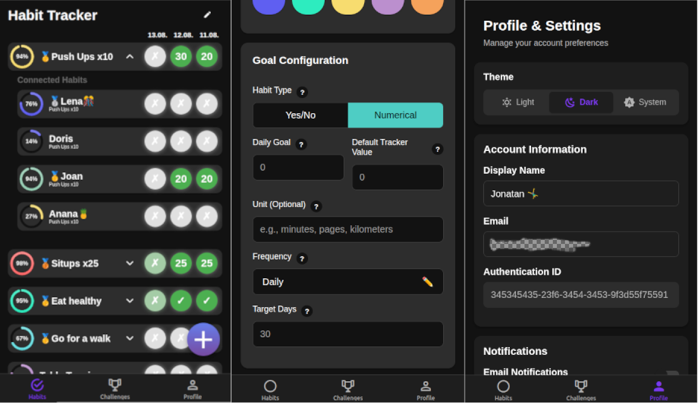

# DEPLOYMENT INSTRUCTIONS AND SETUP GUIDE AS WELL AS PUBLIC DOCKER IMAGES IN PROGRESS AND WILL BE AVAILABLE SOON

# HabitSync

A simple habit tracking application with social features, allowing users to track personal habits and participate in
shared challenges with others.



## Features

- Simple personal habit tracking with progress visualization
- Shared habits to compare progress with friends
- One monthly challenge to compete, including leaderboard and voting for the next challenge
- SSO OIDC authentication (optional: require confirmation for new users)
- Dark/Light mode support
- Simple docker setup for deployment
- React Native frontend, web app installable as pwa (mobile apps coming soon)
- Email notifications as habit reminders (coming soon)

## Deployment
### Docker
Start locally using Docker with the following command. Login with username `test` and password `PASSWORD`.
```
docker run \
  -p 6842:6842 \
  -e BASE_URL=http://localhost:6842 \
  -e APP_SECURITY_BASIC_AUTH_USERS_test=ey$10$TxDKMLg7CtRNBG1ogewyPeGUKup6XqsfNfuvTZa7sLByJoFEWY9E6 \
  ghcr.io/jofoerster/habitsync:latest
```

### Docker Compose
See `docker-compose.yml` for more details on how to run the application using Docker Compose.
```
services:
  web:
    image: ghcr.io/jofoerster/habitsync:latest
    environment:
      - BASE_URL=https://your-domain.com/
      # Choose one or more of the following authentication methods:
      # OIDC Issuers (tested with Authelia, Google), use public client settings (PKCE flow), more than one issuer can be configured
      - APP_SECURITY_ISSUERS_<YOUR-ISSUER_NAME>_URL=<issuer-url>
      - APP_SECURITY_ISSUERS_<YOUR-ISSUER_NAME>_CLIENT-ID=<client-id>
      - APP_SECURITY_ISSUERS_<YOUR-ISSUER_NAME>_NEEDS-CONFIRMATION=true # New users need to to be 'let in' by other user, default: true 
      # Google: Use normal web client settings, set CLIENT-SECRET as workaround for Google
      - APP_SECURITY_ISSUERS_GOOGLE_URL=https://accounts.google.com
      - APP_SECURITY_ISSUERS_GOOGLE_CLIENT-ID=<client-id>
      - APP_SECURITY_ISSUERS_GOOGLE_CLIENT-SECRET=<client-secret> # ONLY AS WORKAROUND FOR GOOGLE, PUBLICALLY AVAILABLE TO CLIENTS!
      # Login using username and password (basic auth), recommended for api access
      - APP_SECURITY_BASIC_AUTH_USERS_<username>=<bcrypt-password-hash> # Create hash using: htpasswd -bnBC 10 "" YOUR_PASSWORD | tr -d ':\n'
      # Mail setup for notifications
      - SPRING_MAIL_HOST=<mail-host>
      - SPRING_MAIL_USERNAME=<mail-username>
      - SPRING_MAIL_PASSWORD=<mail-password>
      - SPRING_MAIL_PORT=587
       # optional SHA-512 hash of your secret key, generate with `openssl rand -base64 64`. Needed to keep sessions across restarts
      - JWT_SECRET=<your-jwt-secret>
    volumes:
      - <path-to-database-file-location>:/data #optional for direct access to database, user 6842:6842 needs access
    user: "6842:6842" # optional, run as user with id 6842, same as the application user in the container
    ports:
      - "6842:6842" # Application accessible under this port
      - "9092:9092" # For database access, optional
```


## Development Setup

## Prerequisites

- Java
- Maven
- Node.js
- npm

### Backend API

1. Navigate to the API directory:
   ```bash
   cd habitsync-api
   ```

2. Install dependencies and run:
   ```bash
   mvn clean install
   mvn spring-boot:run
   ```
3. The API will be available at `http://localhost:8080`

### Frontend UI

1. Navigate to the UI directory:
   ```bash
   cd habitsync-ui
   ```

2. Install dependencies:
   ```bash
   npm install
   ```
   
3. Set necessary environment variables in `.env`

4. Run the development server:
   ```bash
   npm run web
   ```

5. The UI will be available at `http://localhost:8081`

## Database

The application uses H2 database by default with file-based storage. The database file `habittracker-db.mv.db`
optionally can be mounted as a volume in production and can be backed up by copying the file.

## API Documentation

[Add API documentation URL or swagger endpoint]

## Contributing

[Add contribution guidelines]

## Known Issues / TODOs

### Backend

- Complete notification system implementation
- Fix timezone handling
- Add support for habit progress pictures
- Improve shared habit connection cleanup

### Frontend

- Fix timezone issues
- Improve habit list sorting
- Enhance color selection for habits
- Add push notifications support

## Release Process

```bash
./release/prepare-release.sh 1.2.3
git push origin develop

git checkout main
git merge develop
git push origin main

# Release via GitHub Actions
# Go to Actions → "Release and Deploy" → Run workflow → Enter "1.2.3"

git checkout develop
./release/prepare-release.sh 1.3.0-SNAPSHOT
git push origin develop
```
